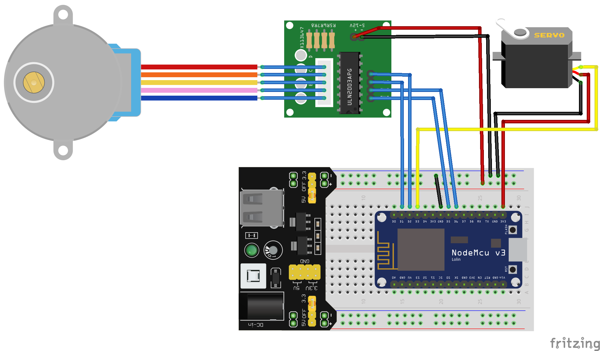
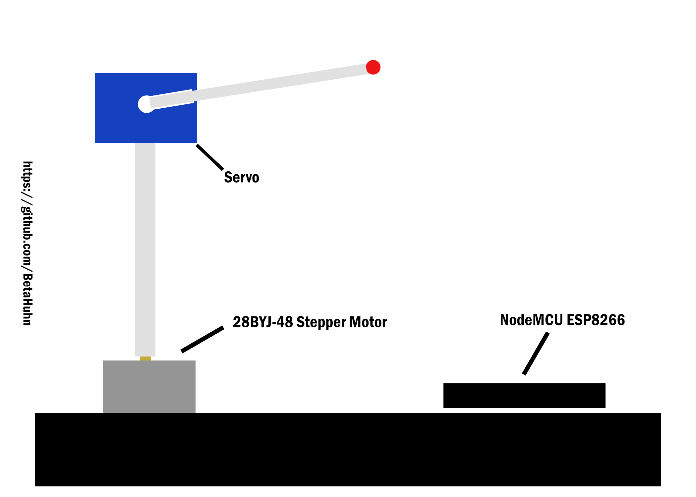

# NodeMCU Satellite-tracker
NodeMCU ESP8266 ISS Satellite tracker

## Description
NodeMCU ESP8266 Satellite tracker can locate the position of Satellites (currently ISS and HST)
and point to it. It uses a stepper motor and a servo for the positioning of the pointer
and a simple webserver for calibration and control. It gets the Azimuth and Elevation of
the satellite from the n2yo API.
Old version used a python server which calculated the Azimuth and Elevation

## Setup
- Define your Wifi Network name and password in the .ino file
- Create an account at [n2yo.com](https://www.n2yo.com/login/register/) and paste your API key into the file
- Also edit the longitude, latitude and elevation according to your current position

## Usage
Once the ESP8266 is booted and connected to your Wifi network, the webserver is started.
You have to go to its IP adress in a web browser and calibrate it. You do this by pressing the buttons on the website which move
the stepper motor until the pointer points north(You can use your phone as a Compass).
This is very important and has to be done as accurate as possible in order to make sure the pointer is accurate.
After finishing the calibration the pointer will move and point to the current postion of the ISS. You can verify this by
using an app like [SpaceStationAR](https://www.sightspacestation.com/).
Now you can switch between satellites by pressing the button and watch the pointer update itself every 10 seconds.

## Circuit diagram

**Connections:**
- Servo: D3
- Stepper: D1/In3, D5/In1, D2/In4, D6/In2

## Sketch

## About
By Maximilian Schiller -  https://github.com/BetaHuhn - 06.08.2019
